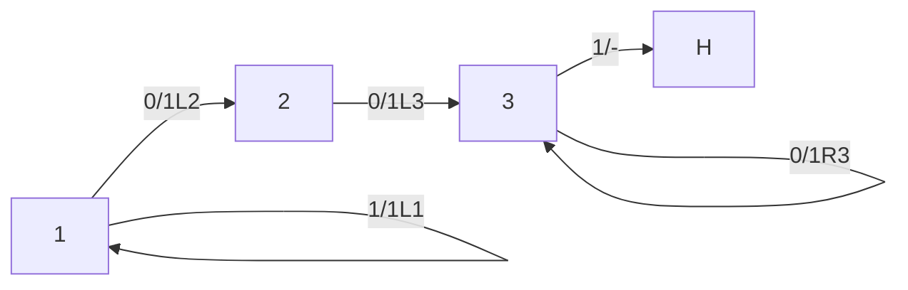
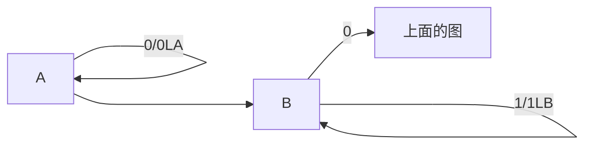
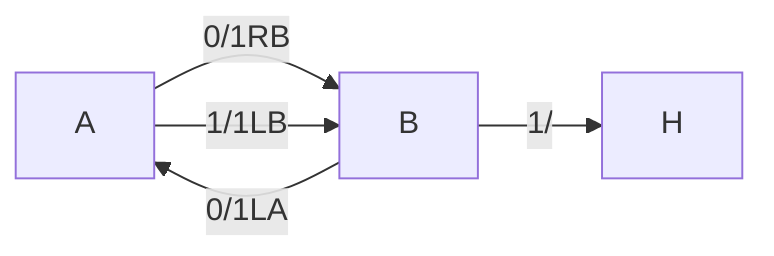
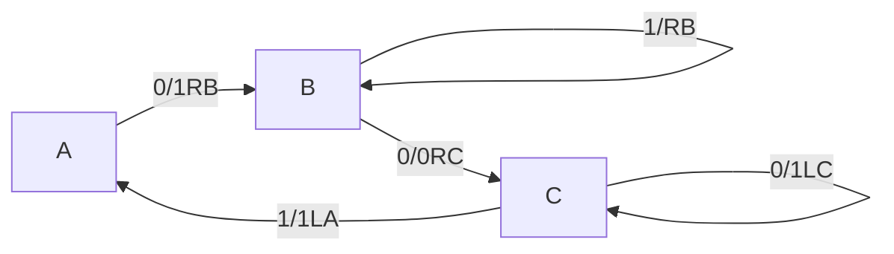

## 图灵机

$0$ 表示分隔符，$1$ 个数表示数。

例子：$M_{+3}$，$\begin{matrix}&0&1\\1&1L2&1L1\\2&1L3&\\3&1R3&1L0\end{matrix}$

如果一开始在右边的 $0$ 中？

### Busy Beaver Problem

$BB(n)=?$

$n$ 个状态，能造多少个 $1$ 后停机？

(或者理解为对 $n+1$ 个状态，多一个 $1$ 是停机状态 $\text{HALT}$)

#### 对于 $n=1$ 

$BB(1)=1$（$\text{step}$）

$\sum(1)=1$（$\max \#\ \text{of}$ $1$，最多造成多少个 $1$）

#### 对于 $n=2$ 

$BB(2)=6$

$\sum(2)=4$

#### 对于 $n=3$

$BB(3)=14$

$\sum(3)=6$

#### more about this

bbchallenge.org

最新算到 $n=5$

## 密码机

理论上不可破解

1. $D_A\xrightarrow{\text{mapping}}D_B$ 单表映射

- Cator    A B C D E
- shift m            A

A B C D

​    X A C

顺序$\rightarrow$$26!$

$\xmapsto {m}$（$m<26$）

miskey

破解方法：$\text{Freq Analysis}$，分析找高频字母（单表映射不改频度！）

2. 多表映射

$\left\downarrow\begin{matrix}_B \backslash^A & A & B & C & D & E & F & G & \cdots\\ 1. A & A & B & C & D & E & F &G &\cdots\\2. B & \cdots & A &B &C &D & E & F & \cdots \\ 3. C & \cdots &\cdots &A & B &C &D & E & \cdots\\4. D& \cdots & \cdots & \cdots& A&B&C&D&\cdots\\\vdots&\vdots&\vdots&\vdots&\vdots&\vdots&\vdots&\vdots&\vdots\end{matrix}\right.$

给 $CAD$，密文。

$A\ \ \ \ B\ \ \ \ C\ \ \ \ D\ \ \ \ E\ \ \ \ \cdots$ 明文

$\downarrow_{C表}\downarrow_{A表}\downarrow_{D表}\downarrow_{C表}\downarrow_{A表}\cdots$

$\cdots\cdots\cdots\cdots\cdots\cdots\cdots\cdots$

$D_{\text{key}}$：$ABC_{(ABC)}\ \begin{matrix}DOG\ DOG\\\downarrow\downarrow\downarrow\ \downarrow\downarrow\downarrow\\ XTS\ UMK\end{matrix}$

明文在置换环里，密文必定在同样长的环里。

参考文章：Rejewski,1980/1981